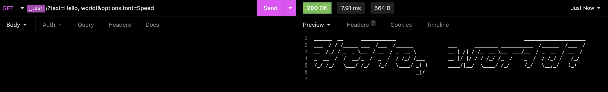

# Fig.rs

Fig.rs is a simple API that allows you to convert text into ASCII art.
## Prerequisites

To build and run Fig.rs, you will need to have the following installed:

    Rust (version 1.41 or higher)

## Building and Running

To build Fig.rs, clone this repository and run cargo build in the root directory of the project.

To run Fig.rs, use cargo run. The server will be available at http://localhost:8000.
## Routes
`GET /`

Serves an intro HTML file.

`GET /?text=<text>`

Converts the text parameter to ASCII art using the standard font. Returns the ASCII art as plain text.

`GET /?text=<text>&font=`

Converts the text parameter to ASCII art using the font specified by the font parameter. The font parameter should be the name of a font file located in the fonts/ directory, without the .flf extension. Returns the ASCII art as plain text.
## Example

To convert the text "hello, world!" to ASCII art using the Speed font, make a `GET` request to http://localhost:8000/?text=hello,%20world!&font=Speed

